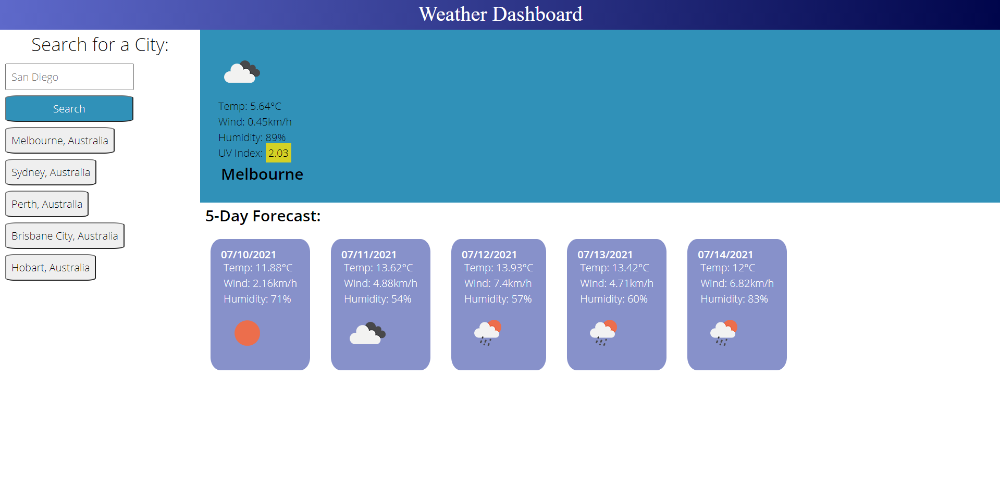

# 06-Weather-Dashboard

Live link: https://chandtheman1.github.io/06-Weather-Dashboard/

Weather Dashboard that have three API calls.
Open Weather API - displays weather data based on latitude and longtitude 
Nominatim API - resolves names based on latitude and longtitude
Nominatim Reverse API - resolves latitude and longitude based on names

When searching, it will give you three options of the same name but different countries/places. Upon selecting, it will display current weather data, including a dynamic color changing UV index. It will also display the forecast weather data as well.

LocalStorage will remember the last searches.

